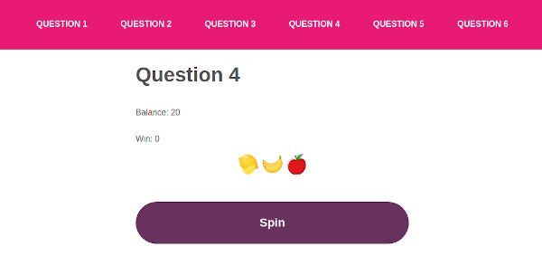
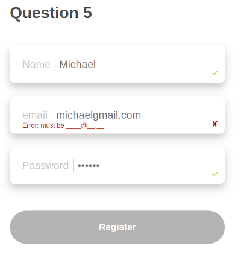

# How to Run the Project

- Go to: https://github.com/salis010/countries/
- Clone
- Install all with `npm i`
- Build: `npm run build`
- Start the server `npm run start`
- In your browser, go to `localhost:3000`

## Running the Tests

### Cypress

- Make sure the server has been started (`npm run start`)
- In terminal, in the project's directory, execute

```npx cypress open```

or

```./node_modules/.bin/cypress open```

- Once the Cypress app loads, press 'Run all specs' from the top-right corner.

- Watch the tests run in the browser window that opens.


### Jest and Enzyme

Execute `npm run test` in terminal, in the project's directory.

## Tech

- React
- Redux
- React Router
- Styled Components
- Node
- Jest
- Enzyme
- Cypress

# At a Glance

The most interesting part is the Cypress test which automatically fills in the registration form, proceeds to the Login page, enters credentials, and asserts that the right object has been created in `localStorage`.

The slot game is covered by a jest test to countercheck that the correct payouts are calculated. Vide 'Question 4' below for more detail.




# The Questions

The Questions code is located in `src/components/questions`

Testing does not cover everything due to time constraints.

However a Cypress tests Questions 5 & 6 from beginning till end, and the slot's payout logic is included as well.

Test files are in `./Cypress` and `./__tests__` folders.

## Questions 1 & 2

Questions 1 & 2 use endpoints from `server.js` which in turn call a third-party api to fetch the data and relay it to the frontend.

## Question 3

Question 3 does not make use of the Node backend, but fetches data directly from the api to get a list of all the countries when the component mounts, using a `useEffect` hook.

Filtering uses a `RegExp` object to dynamically construct the regex. 

For example, if supplied with `'Li'`, all countries matching this pattern is returned (case ignored).


## Question 4

The reel symbols are enumerated.

During a spin, 'symbol' variables for each appearing symbol are incremented.

The win amount is estimated depending on the values of these 'symbol' variables.

This game has a positive RTP, which is not normal, which made me check over and over again.

### The Game's Test

The respective jest test (`/__tests__/slot-game/slot-game.test.js`) does not make use of the same game logic, so that if there is a mistake in the logic used for the game, it is not repeated in the test.

The test:
- determines the number of unique symbols in the line
- determines the frequency of each symbol in the line
- pushes these values in an array and sorts it in descending order according to symbol frequency
- if the number of unique symbols is 3, it means all symbols are different and there is no win
- if the number of unique symbols is 2, it means that there are two matching symbols. Since the array is sorted in descending order, reading the first element of the array will tell the winning symbol
- if the number of unique symbols is 1, it means that there are three matching symbols.
- the returned win from the game is compared to the win determined during the test, and if it matches, 'true' is pushed to a 'results' array. If it does not match, 'false' is pushed into the array
- This is repeated for many times, say 1,000,000
- If all spins have had there win successfully counterchecked, then there should be no 'false' entry in the 'results' array:

```expect(results.includes(false)).toBe(false)```

## Question 5 

The input fields provide feedback to the user, through tiny icons at the bottom-left, from the moment he starts editing the fields. When a field loses focus, more feedback is provided if validation fails (there is just one error message for each field irrispective of what the error is, since this is just a demonstration exercise)

All fields have validation, albeit quite simple.



## Question 6

Anything the user enters is not validated. In a live scenario this would serve as a minor securty feature since no feedback of what's wrong is given to perpetrators.

Once 'Login' is pressed, an object is created in `localStorage`. It just contains the name of the user.


## The Backend

The server file is `./sever.js` with all other backend logic residing at './src/backend`.

User authentication occurs at `./src/backend/auth/authenticate.js`

Backend functions are also tested (vide `./__tests__/jest/backend`)

## CSS

Not as much work as desired here, due to time constraints.

Responsiveness might suffer a bit.

## Improvements
The below improvements were not implemented due to time:
- check whether a user is already registered before possibly registering duplicate users
- password is saved in clear text
- the backend is storing the JWT secret in clear text instead of in an environmental variable
- `./src/store/actions.js` and `./src/store/action-types.js` would be split into multiple files in a production scenario 
- index_bundle.js is sligtly big. In a production scenario more time would be dedicated to reduce this file's size
